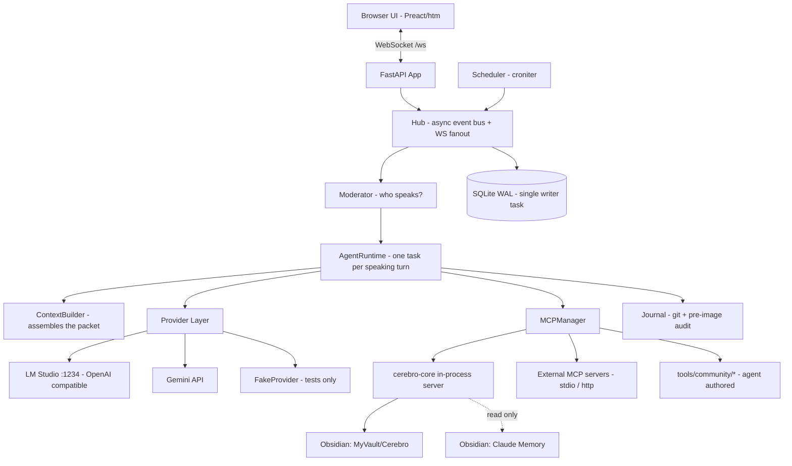

# Cerebro v2 — Architecture & Build Plan

**Status**: Authoritative. Supersedes `docs/CEREBRO_V2_SPEC.md` (v2.0.0), which remains as the vision document.
**Version**: 2.1.0
**Date**: 2026-08-13
**Architect**: Claude (Opus 5)
**Executor**: Gemini / Antigravity (`agy`), with Claude reviewing each slice
**Owner**: Dante

---

## 0. How to read this document

This is a **prescriptive build spec**, not a discussion. Every section that says MUST is a
constraint on the implementation, not a preference. Where a section says CONFIG, the value is a
default that lives in `config.py` and can be changed at runtime without a code edit.

Gemini: implement slices in order. Do not start slice N+1 until slice N's acceptance criteria
pass. Each slice lands as one commit (or a small series) on the `v2` branch, with its
documentation updated in the same commit.

---

## 1. What Cerebro v2 is

A local, Slack-shaped headquarters where Dante works alongside a team of autonomous agents.
Agents have personas, private memory, their own filesystem home, tools supplied over MCP, and
the ability to start conversations, recruit each other, schedule themselves, and do real work
while nobody is watching.

**Non-goals for v2.0**: multi-user, cloud hosting, mobile app, fine-tuning, RAG over embeddings,
voice I/O.

---

## 2. Decisions that shape everything else

These were settled before design. They are not open for re-litigation during implementation.

| # | Decision | Consequence |
|---|---|---|
| D1 | **MCP is the tool layer.** Cerebro is an MCP client. | No bespoke plugin format. Agent-authored tools are stdio MCP servers → process isolation is free. Existing MCP servers (filesystem, GitHub, browser, Obsidian) work day one. |
| D2 | **Coding-agent delegation is gated per agent.** | `delegate_coding_task` is only exposed to agents whose profile sets `delegation_enabled: true`. Everyone else routes work through those agents. |
| D3 | **Full autonomy, audited after the fact.** No approval prompts. | Agents act freely. Safety comes from *reversibility and caps*, not dialogs: git-journaled workspace, pre-image journal for out-of-workspace writes, hard turn/depth/budget caps, global kill switch. |
| D4 | **Memory lives in a separate Cerebro Obsidian vault.** | `D:\Obsidian\MyVault\Cerebro` is writable. `D:\Obsidian\MyVault\Claude Memory` is **read-only** to every agent, enforced in the filesystem layer, not in a prompt. |
| D5 | **Localhost only.** Binds `127.0.0.1`. | No auth required in v2.0, but the auth seam (a `Principal` object on every request/WS connection) is built now so LAN/Tailscale is a config change later, not a refactor. |
| D6 | **Hard cutover on branch `v2`.** | PyQt5 is deleted at the start of the branch, not gradually. `main` keeps working until `v2` reaches the parity bar in §12. |
| D7 | **No Node build chain.** | Frontend is vendored, pinned Preact + htm served by FastAPI. Zero `npm`, which keeps us inside the supply-chain hardening rules (exact pins, no install scripts, no lockfile drift). |

### 2.1 One flagged risk, accepted

D3 gives an LLM write access to a machine that holds your code projects and your vault. The
guardrails in §8 are what make that acceptable: nothing an agent does is unrecoverable, and a
runaway agent hits a wall in seconds rather than at sunrise. The deny-list in §8.3 is
non-negotiable and is enforced in code.

---

## 3. Process & component model

Single Python process, `asyncio` throughout, `uvicorn` serving FastAPI.



| Component | File | Responsibility |
|---|---|---|
| `Hub` | `cerebro/hub.py` | In-process pub/sub. Every state change is an event; the WS layer is just a subscriber. Nothing writes to the browser directly. |
| `Store` | `cerebro/db.py` | `aiosqlite`, WAL mode. **One** writer task consuming an `asyncio.Queue`; readers go direct. This is the only thing that touches the DB. |
| `Moderator` | `cerebro/moderator.py` | Decides which agents speak on a message. §6. |
| `AgentRuntime` | `cerebro/runtime.py` | Executes one agent turn: context → provider → tool loop → message. |
| `ContextBuilder` | `cerebro/context.py` | Assembles and token-budgets the context packet. §7. |
| `MCPManager` | `cerebro/mcp/manager.py` | Owns MCP client sessions, aggregates tool catalogs, enforces per-agent allowlists. |
| `Journal` | `cerebro/journal.py` | Reversibility for every mutating action. §8. |
| `Scheduler` | `cerebro/scheduler.py` | Per-agent cron triggers; fires synthetic messages into the normal pipeline. |
| `Budgets` | `cerebro/budgets.py` | Token/spend/delegation ceilings, per agent and global. |

**Concurrency rules (MUST):**
- One `asyncio.Semaphore` per provider. LM Studio default 2 (0.4 batches in parallel; more than 2
  on a 16 GB card degrades everyone). Gemini default 4.
- Within a channel turn, speakers run **sequentially** — speaker 2 sees speaker 1's output.
- Across channels, turns run **concurrently**, bounded by the provider semaphores.
- Tool calls within one assistant message run in parallel, bounded to 4.

---

## 4. Data model

SQLite, `data/cerebro.db`. Schema lives in `cerebro/schema.sql`, applied by a numbered migration
runner (`cerebro/migrations/NNN_*.sql`). No ORM.

```sql
teams(id TEXT PK, slug TEXT UNIQUE, name TEXT, description TEXT,
      workspace_path TEXT, created_at TEXT)

agents(id TEXT PK, name TEXT UNIQUE, display_name TEXT, avatar TEXT, role TEXT,
       provider TEXT, model TEXT, params_json TEXT, api_key_ref TEXT,
       home_path TEXT, enabled INT, delegation_enabled INT DEFAULT 0,
       created_at TEXT)

agent_teams(agent_id TEXT, team_id TEXT, PRIMARY KEY(agent_id, team_id))

channels(id TEXT PK, team_id TEXT NULL, kind TEXT,          -- 'channel'|'dm'|'war_room'
         name TEXT, topic TEXT, created_by TEXT, created_at TEXT,
         archived_at TEXT NULL, summary TEXT, summary_upto_msg INTEGER)

channel_members(channel_id TEXT, member_id TEXT, member_kind TEXT,  -- 'user'|'agent'
                listen_mode TEXT DEFAULT 'active',   -- 'active'|'mention_only'|'muted'
                joined_at TEXT, PRIMARY KEY(channel_id, member_id))

messages(id INTEGER PK AUTOINCREMENT, channel_id TEXT, author_id TEXT, author_kind TEXT,
         kind TEXT,                                   -- 'chat'|'system'|'tool'|'event'|'error'
         body TEXT, quote_msg_id INTEGER NULL,
         turn_id TEXT, depth INTEGER DEFAULT 0,
         created_at TEXT, meta_json TEXT)

tool_calls(id TEXT PK, message_id INTEGER, agent_id TEXT, server TEXT, tool TEXT,
           args_json TEXT, result_json TEXT, status TEXT, error TEXT,
           started_at TEXT, ended_at TEXT, duration_ms INTEGER)

tasks(id TEXT PK, title TEXT, body TEXT, owner_agent_id TEXT, channel_id TEXT,
      team_id TEXT, status TEXT,                       -- open|in_progress|blocked|done|cancelled
      artifacts_json TEXT, created_at TEXT, updated_at TEXT, due_at TEXT NULL)

cron_jobs(id TEXT PK, agent_id TEXT, cron_expr TEXT, timezone TEXT,
          target_channel_id TEXT, prompt TEXT, enabled INT,
          last_run_at TEXT, next_run_at TEXT)

audit_events(id INTEGER PK AUTOINCREMENT, ts TEXT, actor_id TEXT, actor_kind TEXT,
             action TEXT, target TEXT, detail_json TEXT,
             revert_ref TEXT NULL, reverted_at TEXT NULL)

budget_usage(scope TEXT, scope_id TEXT, period TEXT, window_start TEXT,
             calls INTEGER, input_tokens INTEGER, output_tokens INTEGER,
             usd REAL, delegations INTEGER, PRIMARY KEY(scope, scope_id, period, window_start))
```

Indexes MUST exist on `messages(channel_id, id)`, `messages(turn_id)`,
`audit_events(ts)`, `tasks(owner_agent_id, status)`, `cron_jobs(next_run_at)`.

### 4.1 Teams, agents, and memory scoping

Agents belong to zero or more teams (`agent_teams`). This is how a shared agent works.

**Scoping rule (MUST):** an agent's context contains its **own** memory (all of it — an agent is
one person with one brain) plus the **team notes of the channel it is currently speaking in**.
It never receives another team's notes in the same turn. That is the entire answer to "shared
across teams without leaking between personal and professional work."

Seed teams: `personal-assistant` (DM home), `career-ops`, `cerebro-core`, `projects`.

---

## 5. Message pipeline

```
inbound message (human | agent | cron | event)
  → Store.append(message)                 [assign turn_id + depth]
  → Hub.publish(message.new)              [browser renders immediately]
  → TurnGuard.check(turn_id)              [caps — §8.4]
  → Moderator.select_speakers(channel, message)
  → for each speaker (sequential):
        ContextBuilder.build()
        AgentRuntime.run_turn()           [provider stream + tool loop]
        Store.append(reply);  Hub.publish(message.delta / message.new)
```

**turn_id / depth (MUST):**
- A human message starts a new `turn_id`, `depth = 0`.
- Any agent message caused by it inherits the `turn_id` and sets `depth = parent.depth + 1`.
- A cron fire starts a new `turn_id` at `depth = 0` with `author_kind = 'system'`.

This is the spine of loop control. Do not implement the pipeline without it.

---

## 6. Speaking protocol

The v2.0 spec's "poll every agent with a should-I-speak prompt" is replaced. With 5 agents that is
5 serialized local inferences before anybody types a character.

**Algorithm (MUST):**

1. **DM channel** → the single agent member always speaks. No moderator call.
2. **Explicit `@mentions`** → those agents speak, in mention order. They are guaranteed. No
   moderator call.
3. **No mentions, multi-agent channel** → **one** moderator call to the small model:
   - Input: last CONFIG `moderator_window` (default 12) messages, plus the roster as
     `name — one-line role description — listen_mode`.
   - Output: strict JSON `{"speakers": ["<agent_name>", ...], "reason": "<20 words>"}`.
   - Hard cap of CONFIG `max_auto_speakers` (default 2).
   - Agents with `listen_mode='mention_only'` are excluded from candidacy; `'muted'` are excluded
     entirely.
4. **Moderator failure** (timeout, unparseable JSON after one repair retry, model unavailable) →
   fall back to **nobody speaks**. Silence is the safe default; Dante can @mention.

Quoting: agents are instructed in the operating manual (§7.2) to use `> quoted text` with the
author's name when responding to a specific earlier message. `quote_msg_id` is set when the agent
uses the `quote` field of its reply; the UI renders it as an attributed blockquote. **No threads.**

---

## 7. The context packet

This is the single largest determinant of output quality. It is assembled by `ContextBuilder` with
a fixed token budget (CONFIG `context_budget`, default 24000) and trimmed in reverse priority
order when over budget.

### 7.1 Sections, in order

| # | Section | Source | Budget | Trim priority |
|---|---|---|---|---|
| 1 | Identity | `agents/{id}/system_prompt.md` + name, role, avatar, current local time | 2k | never |
| 2 | Operating manual | generated, §7.2 | 1.5k | never |
| 3 | Channel frame | channel name/topic, kind, roster with roles, team name | 500 | never |
| 4 | Agent state | `scratchpad.md` (tail-truncated), open tasks owned by this agent | 4k | 4th |
| 5 | Retrieved memory | top-k FTS5 hits from agent vault + current team notes | 4k | 3rd |
| 6 | Shared drive index | depth-2 tree of the team workspace (names only, never contents) | 1k | 2nd |
| 7 | Channel history | rolling summary + last CONFIG `history_window` (default 30) messages | rest | 1st |
| 8 | Trigger | the message being responded to, explicitly labeled | — | never |

**Memory retrieval**: SQLite FTS5 (BM25) over an index of the vault's markdown. **No embeddings in
v2.0** — it keeps the dependency surface small and, more importantly, makes retrieval debuggable.
`MemoryIndex` is an interface; an embedding implementation can be dropped in later without
touching `ContextBuilder`.

**History summarization**: when a channel exceeds `history_window * 2` messages, a background job
summarizes messages older than the window into `channels.summary` and records
`summary_upto_msg`. Summaries are appended to, never regenerated from scratch.

### 7.2 The operating manual

A generated block, identical for every agent, that teaches the system itself. It MUST cover:
channels vs DMs vs war rooms; how @mentions oblige a reply and how to stay quiet otherwise;
quoting instead of threading; the shared drive paths and that peers can read them; that memory is
markdown in an Obsidian vault and how to write a good note; that Claude Memory is readable but
not writable; how to start a new channel and recruit peers; that turns are capped and how to hand
back to Dante; how to file and update a task.

It is generated from `cerebro/prompts/operating_manual.md.j2` with the agent's own paths and tool
list interpolated. When behaviour changes, this file changes — it is documentation the agents read.

---

## 8. Autonomy, reversibility, and caps

D3 says no prompts. These are the mechanisms that make that safe.

### 8.1 Workspace journal (git)

`workspace/` is its own git repository. Every mutating tool call is wrapped:

```
before: record HEAD
after:  git add -A && git commit -m "[agent:{name}][turn:{turn_id}] {tool}: {summary}"
        → audit_events.revert_ref = <sha>
```

Empty diffs do not create commits. `cerebro revert <audit_id>` performs `git revert` of that sha.

### 8.2 Out-of-workspace journal (pre-image)

Writes outside `workspace/` are permitted (D3) and are journaled differently: the existing file is
copied to `data/journal/{ts}/{sha256-of-path}` **before** the write, and `audit_events` records
both paths. `cerebro revert <audit_id>` copies the pre-image back. Deletions are journaled the same
way. A write to a path with no pre-image is recorded as a creation and reverts to deletion.

### 8.3 Deny-list — enforced in code, not in prompts (MUST)

Writes are **refused** (with an error the agent sees and can reason about) for:

- `D:\Obsidian\MyVault\Claude Memory\**` — read-only bridge (D4)
- `data/.secrets.env`, anything matching `*.env`, `*.pem`, `*.key`
- any `.git/` internal directory
- `C:\Windows\**`, `C:\Program Files\**`, the Cerebro `data/cerebro.db`
- the agent's own `profile.json` (agents may not self-promote to `delegation_enabled`)

Reads of Claude Memory are allowed and are what "read-only bridge" means.

### 8.4 Turn caps (`TurnGuard`)

| Cap | Default | On breach |
|---|---|---|
| `max_depth` | 8 | freeze turn |
| `max_agent_messages_per_turn` | 12 | freeze turn |
| `max_turn_wallclock` | 10 min | freeze turn |
| `max_tool_iterations` (per agent turn) | 12 | end turn, agent posts what it has |
| `max_self_initiated_per_hour` (per agent) | 6 | agent's outbound tool call fails |

**Freeze** = a system message is posted (`⏸ Turn budget exhausted — @Dante`), no further agent
messages are accepted on that `turn_id`, and the channel shows a frozen badge. A human message
unfreezes it by starting a new turn.

### 8.5 Budgets

Per-agent and global daily ceilings on Gemini spend, total tokens, and delegated coding jobs.
On breach the agent posts to `#ops` and is disabled until the window rolls. Defaults live in
`config.py` — start conservative (global $5/day, 3 delegations/day).

### 8.6 Kill switch

`POST /api/pause` (and a prominent UI button) sets a global flag: running turns are cancelled at
the next await point, no new turns start, the scheduler stops firing. `POST /api/resume` clears it.
This MUST work when the LLM backends are wedged.

---

### 8.7 Shared mutable state and leases

Agents share one workspace. That is the point — a team that cannot touch the same repository is
not a team, and isolating every agent in its own copy would trade the whole collaboration premise
for a problem that barely exists. Concurrent *file* edits are rare and git-mergeable.

What is not shareable is **unannounced global state**: the current git branch, a running dev
server's port, a database being migrated, a model being swapped in LM Studio. One agent changing
these silently breaks every other agent's assumptions, and no amount of file-level care prevents
it. This was proven in practice during Slice 0, when Claude moved the repository's HEAD while
Antigravity was mid-write; nothing was lost, but nothing about the file layout had protected us.

**Leases (MUST)**. `cerebro-core` exposes:

| Tool | Signature | Behaviour |
|---|---|---|
| `acquire_lease` | `(resource, ttl_s=600, reason)` | Blocks briefly, then fails with the current holder's name and reason. |
| `release_lease` | `(resource)` | |
| `list_leases` | `()` | Also rendered live in the right-hand UI panel. |

Resource names are conventional strings: `repo:<name>:HEAD`, `db:<name>:schema`,
`port:<number>`, `lmstudio:loaded-model`.

Rules:

- Any operation that moves a repository's HEAD — `checkout`, `switch`, `reset`, `rebase`, `merge`,
  `stash` — MUST hold `repo:<name>:HEAD`. `run_command` inspects the command line for these verbs
  and refuses without the lease. This is a mutex between agents, **not** a human approval prompt:
  it is consistent with D3, which forbids asking Dante for permission, not agents coordinating
  with each other.
- Acquiring or releasing a lease posts an automatic message into the channel the agent is acting
  in. Coordination is visible by default; a silent lease is a bug.
- Leases expire. A crashed agent cannot deadlock the team, and an expiry posts a notice to `#ops`.
- Leases are advisory for everything else. Ordinary file edits do not need one — take the lease
  when you are about to change something *other agents cannot see you changing*.

The general principle, worth stating because it will come up again: **the channel is the
coordination medium, not the filesystem.** Agents should announce intent before mutating shared
state, in the room where their peers are listening. Cerebro's job is to make that the path of
least resistance and to enforce it for the handful of resources where forgetting is fatal.

---

## 9. Provider layer

```python
# cerebro/providers/base.py
class Provider(Protocol):
    name: str
    async def stream(
        self,
        messages: list[Message],
        tools: list[ToolSpec],
        params: Params,
    ) -> AsyncIterator[Delta]: ...
```

`Delta` is a tagged union: `TextDelta(text)`, `ToolCallDelta(id, name, args_fragment)`,
`Usage(input, output)`, `Done(reason)`. Every provider normalizes to this; the runtime knows
nothing about OpenAI or Google shapes.

### 9.1 LM Studio (`lmstudio.py`)

- `POST {base}/v1/chat/completions`, `stream: true`, OpenAI tool-calling schema.
- `GET {base}/v1/models` for the model picker in the UI.
- Base URL CONFIG `http://127.0.0.1:1234`.
- LM Studio 0.4 batches parallel requests to one model — the semaphore of 2 is a VRAM guard, not a
  protocol limit.
- **Two loaded models** is the intended setup: the main model (`google_gemma-4-26b-a4b-it@iq4_xs`)
  for agent turns, plus a ~4B for moderation, speak-evaluation and summarization. Model ids are
  per-agent config; the moderator model is a separate CONFIG key.
- **Structured output**: LM Studio supports `json_schema` mode only (not `json_object`). The
  moderator MUST use `json_schema`. If a model can't honour it, one repair retry, then §6.4
  fallback.

### 9.2 Gemini (`gemini.py`)

- `google-genai` SDK, streaming, function declarations converted from `ToolSpec`.
- Model defaults: `gemini-3.1-pro` for reasoning-heavy agents, `gemini-3.6-flash` for routine
  agents, `gemini-3.5-flash-lite` for cloud-side moderation if local is busy.
  *(The v2.0 spec's `gemini-2.5-*` / `gemini-1.5-*` names are stale — do not use them.)*
- Retries with jittered backoff on 429/503; on exhaustion the agent posts an error message rather
  than silently dying.

### 9.3 FakeProvider (`fake.py`)

Scripted deltas driven by a fixture file. **Mandatory** — every pipeline test uses it. No test may
require LM Studio or network access.

### 9.4 Secrets

API keys MUST NOT appear in `profile.json` or anywhere in git. `profile.json` carries
`api_key_ref: "gemini_personal"`; resolution order is Windows Credential Manager (`keyring`) →
`data/.secrets.env` (gitignored) → environment. A missing key is a startup warning, not a crash —
LM Studio agents still work.

---

## 10. MCP layer

### 10.1 Registry

`mcp_servers.json` at the repo root:

```json
{
  "servers": {
    "cerebro-core":   { "transport": "inprocess" },
    "filesystem":     { "transport": "stdio", "command": "...", "args": ["..."],
                        "trust": "trusted" },
    "obsidian":       { "transport": "stdio", "command": "...", "args": ["..."] },
    "community/<x>":  { "transport": "stdio", "command": "python",
                        "args": ["tools/community/<x>/server.py"], "trust": "sandboxed" }
  }
}
```

Per-agent exposure is an allowlist of `server:tool` globs in `profile.json`
(`"tools_enabled": ["cerebro-core:*", "filesystem:read_*"]`). Default for a new agent:
`["cerebro-core:*"]`.

### 10.2 `cerebro-core` — the in-process server

The system tools. All of them are journaled and audited.

| Tool | Signature | Notes |
|---|---|---|
| `create_channel` | `(name, topic, participants[], initial_message, team?)` | Creates the channel, adds members **including Dante**, posts the first message. Rate-limited by §8.4. |
| `invite_agent` | `(channel, agent)` | |
| `post_message` | `(channel, body, quote_msg_id?)` | Cross-channel posting. |
| `list_agents` / `get_agent_profile` | | Read-only roster access. |
| `scratchpad_read` / `scratchpad_append` / `scratchpad_replace` | | Agent's own scratchpad only. |
| `memory_search` | `(query, scope='self'|'team'|'claude_memory')` | FTS5. `claude_memory` is read-only. |
| `memory_write` | `(title, body, tags[], links[])` | Writes an Obsidian note with frontmatter into the agent's vault folder. Refused for `claude_memory`. |
| `task_create` / `task_update` / `task_list` | | Durable work state. |
| `schedule_cron` / `list_crons` / `delete_cron` | | Agent self-scheduling. |
| `fs_read` / `fs_write` / `fs_list` / `fs_move` | | Journaled; deny-list enforced. |
| `run_command` | `(cmd, cwd, timeout=120)` | Journaled, output captured, no shell interpolation of agent text into an unquoted shell. |
| `delegate_coding_task` | `(repo, branch, task, backend='agy'|'claude')` | **Gated on `delegation_enabled`** (D2). Runs in a git worktree, streams progress into the channel, returns the diff. |
| `publish_tool` | `(name, description, code)` | Writes `tools/community/{name}/server.py`, registers it, hot-loads it. Audited with the full source. |

### 10.3 Agent-authored tools

`publish_tool` writes a **stdio MCP server**, not an in-process function. A buggy agent tool
crashes its own subprocess and returns an error; it cannot take down Cerebro. New community
servers start at `trust: "sandboxed"` (restricted cwd, no inherited secrets) and appear in `#ops`
with a link to the source.

---

## 11. Frontend

**Stack**: FastAPI static mount + vendored Preact + htm in `cerebro/web/vendor/`, pinned by exact
version with SRI hashes recorded in `cerebro/web/vendor/VENDOR.md`. No npm, no bundler, no build
step. Markdown rendering via a single vendored, pinned renderer with HTML sanitization on.

**Transport**: one WebSocket at `/ws`. Envelope: `{"type": "...", "payload": {...}, "seq": n}`.
REST is used only for non-realtime CRUD (agent create/edit, cron edit, audit query).

Event types (MUST): `message.new`, `message.delta`, `message.done`, `agent.status`,
`channel.new`, `channel.update`, `task.update`, `tool.call`, `tool.result`, `turn.frozen`,
`budget.warning`, `system.pause`, `error`.

**Reconnect**: client tracks last `seq` per channel; on reconnect it requests
`GET /api/channels/{id}/messages?after={id}` and replays. Streaming deltas that were lost are not
recovered — the final message is authoritative.

**Layout**:
- **Left**: teams → channels (`#`) / DMs (`@`); agent roster with live status (idle / thinking /
  tool:`name` / scheduled / paused); global pause button.
- **Center**: flat message stream. Agent messages carry avatar + name chip. Tool calls render as
  collapsible cards (name, args, result, duration). `> quotes` render as attributed blockquotes.
  Frozen turns show an inline banner.
- **Right (collapsible)**: agent profile + live scratchpad; channel members; channel files; open
  tasks; recent audit events with a revert button.
- **Composer**: `@` autocomplete, `/` commands (`/invite`, `/pause`, `/summarize`, `/task`,
  `/mute`), drag-drop file → team workspace.

Dante is a member of every channel by construction — including agent-to-agent war rooms. There is
no channel he cannot see.

---

## 12. Repository layout & the cutover

Branch `v2`. PyQt5 is deleted in the first commit.

```
D:\Code Projects\Cerebro\
├── cerebro/
│   ├── config.py  db.py  schema.sql  models.py  hub.py
│   ├── moderator.py  runtime.py  context.py  scheduler.py
│   ├── journal.py  budgets.py  audit.py  turnguard.py
│   ├── providers/    base.py lmstudio.py gemini.py fake.py
│   ├── mcp/          manager.py core_server.py registry.py
│   ├── prompts/      operating_manual.md.j2  moderator.md.j2  summarize.md.j2
│   ├── api/          app.py ws.py routes_agents.py routes_channels.py routes_admin.py
│   ├── migrations/   001_init.sql ...
│   └── web/          index.html app.js style.css vendor/
├── agents/{agent_id}/  profile.json  system_prompt.md  scratchpad.md  logs/  tools/
├── workspace/          (own git repo)  shared/  teams/{team_slug}/
├── tools/              system/  community/
├── data/               (gitignored) cerebro.db  .secrets.env  journal/
├── docs/               this file + per-subsystem docs
├── tests/
├── mcp_servers.json
└── main.py             → uvicorn entrypoint
```

Agent **memory** does not live under `agents/`. It lives in the vault:

```
D:\Obsidian\MyVault\Cerebro\
├── _index.md
├── agents/{agent_id}/MEMORY.md + notes
├── teams/{team_slug}/
└── shared/
```

`CEREBRO_VAULT` env var overrides the root. `agents/{id}/` holds runtime state only.

### 12.1 Deleted on day one

`app.py`, `tab_*.py`, `dialogs.py`, `worker.py`, `theme_utils.py`, `*.qss`, `tts.py`,
`voice_input.py`, `fine_tuning.py`, `local_llm_helper.py`, `workflows.py`, `message_broker.py`,
`screenshot.py`, `cerebro.spec`, `build_windows_installer.bat`, and their tests.

### 12.2 Migrated

| Legacy | Destination |
|---|---|
| `agents.json` | one-shot script → `agents/{id}/profile.json` + `system_prompt.md`; `model` values remapped from Ollama tags to LM Studio ids (interactive prompt for unmapped). |
| `tasks.json` | → `cron_jobs` + `tasks` rows. |
| `tools.json`, `tool_plugins/` | → `tools/system/*` as MCP servers. Port only the ones that still earn their place: `web-scraper`, `file-summarizer`, `math-solver`, `windows-notifier`, `desktop-automation`. |
| `automations.json`, `automation_sequences.py` | → `tools/system/desktop_automation/` MCP server, optional, off by default. |
| `metrics.py` | → `budget_usage` + audit UI. |
| `transcripts.py` | → `messages` table. |
| `workflows.json` | **discarded.** Channels and @mentions replace it. |
| `fine_tuning.py` | → `scripts/finetune.py`, out of the app. |

### 12.3 Parity bar for merging `v2` → `main`

All of: chat with an agent streams from LM Studio; multi-agent channel works with caps proven;
agent tools run over MCP with journaling; cron fires; memory persists across restart; migration
script has run against the real `agents.json`; docs and README rewritten; `pytest` and `flake8`
green.

---

## 13. Build slices

Each slice is independently demoable. **Docs update in the same commit** — a feature without
current docs is not done.

### Slice 0 — Skeleton
Branch `v2`; delete PyQt; `cerebro/` package; `config.py`; SQLite schema + migration runner;
`FakeProvider`; pytest + flake8 wired; `python main.py` serves an empty shell page.
**Accept**: tests green; page loads; DB created with all tables.

### Slice 1 — Walking skeleton
One agent, one DM channel, LM Studio streaming end-to-end over WS. Hub, Store, AgentRuntime,
minimal context (identity + history).
**Accept**: type in the browser, tokens stream from the local model, message persists, restart
and the conversation is still there.

### Slice 2 — MCP + core tools
`MCPManager`, `cerebro-core` in-process server, `fs_*`, `scratchpad_*`, `create_channel`,
`post_message`. Journal (git + pre-image). Tool cards in the UI.
**Accept**: agent writes a file into `workspace/` and creates a new channel from chat; a git commit
exists with the agent/turn in the message; `cerebro revert` restores; a deny-list write is refused
and audited.

### Slice 3 — Multi-agent channels
Moderator, @mention parsing, `turn_id`/`depth`, `TurnGuard`, sequential arbitration, quoting.
**Accept**: a 3-agent channel discusses and *stops*; a deliberately loop-prone fixture (two agents
told to always @mention each other) is frozen by the caps within `max_depth` messages; moderator
failure falls back to silence.

### Slice 4 — Memory & context
Vault layout, `MemoryIndex` (FTS5), `memory_search` / `memory_write`, the full `ContextBuilder`
with budgets, channel summarization, team scoping.
**Accept**: an agent recalls a fact written two sessions earlier; a write attempt against Claude
Memory is refused; an agent in team A never sees team B's notes (asserted in a test).

### Slice 5 — Autonomy
Scheduler, tasks, budgets, kill switch, audit panel + revert button.
**Accept**: a cron wakes an agent overnight, it does work and posts a summary; budget breach
disables an agent and posts to `#ops`; pause halts everything mid-turn.

### Slice 6 — Gemini + delegation + teams
Gemini provider, `delegate_coding_task` gated on `delegation_enabled`, teams UI, seed the four
teams and their agents.
**Accept**: the engineer agent delegates a real task to `agy` in a worktree and reports back with a
diff; a non-delegating agent cannot see the tool in its catalog.

### Slice 7 — Retirement & docs
Migration script against the real config files; port the surviving legacy tools as MCP servers;
rewrite README and `docs/`; delete what §12.1 says to delete.
**Accept**: parity bar §12.3; `main` merged.

---

## 14. Seed roster

| Agent | Team | Provider | Delegation | Purpose |
|---|---|---|---|---|
| **Jarvis** | personal-assistant | LM Studio (gemma-4-26b) | no | Default DM. Morning brief cron, reminders, general help. |
| **Scout** | career-ops | Gemini 3.6 Flash | no | Portal sweeps (Indeed, ZipRecruiter, Employ Florida, LinkedIn), résumé tailoring, application tracking. |
| **Archie** | cerebro-core | Gemini 3.1 Pro | no | Architecture and review. Writes specs, does not write code. |
| **Forge** | cerebro-core | Gemini 3.1 Pro | **yes** | The only agent with `delegate_coding_task`. Turns Archie's specs into `agy` jobs. |
| **Ledger** | (all) | LM Studio (small) | no | Ops/auditor. Watches budgets, journals, failures; owns `#ops`. Shared across every team — the reference implementation of a cross-team agent. |

Channels at seed: `#ops`, `#general`, `#career-ops`, `#cerebro-core`, `#projects`, plus a DM per
agent.

---

## 15. Testing

- **No test may require LM Studio, Gemini, or the network.** `FakeProvider` + fixture MCP servers.
- Golden tests for moderator JSON parsing, including malformed output and the repair retry.
- Loop-cap tests: assert freeze at exactly `max_depth`.
- Journal tests: write → revert → file restored, in and out of workspace.
- Deny-list tests: each denied path class refuses and audits.
- Scoping test: team A agent's context contains no team B note.
- Migration test: real-shaped `agents.json` → profiles, with an unmapped model handled.
- Contract test per provider against recorded fixtures for the streaming shapes.

---

## 16. Failure behaviour (MUST be explicit, not incidental)

| Failure | Behaviour |
|---|---|
| LM Studio not running | Startup warning; agents using it post `⚠ backend offline` and the channel stays usable; `/api/health` reports it; UI shows a red backend chip. |
| Model unloaded / JIT swap | Retry once after 5s; then treat as offline. |
| Gemini 429/503 | Jittered backoff ×3, then an error message in-channel, agent stays enabled. |
| MCP server crash | Tool call returns an error the agent can read; manager restarts the server on next use with a backoff; `#ops` gets a notice after 3 failures. |
| Tool loop | `max_tool_iterations` ends the turn; the agent posts what it has. |
| Malformed tool args from a weak local model | One repair retry with the schema echoed back; then error to the agent. |
| DB write failure | Fatal — surfaced in UI, pause engaged. Silent data loss is not acceptable. |

---

## 17. What changed from `CEREBRO_V2_SPEC.md` v2.0.0

For reconciliation during review:

1. **Tool layer is MCP**, not bespoke Python plugins (D1).
2. **Speaking protocol** replaced: one moderator call, not N per-agent evaluation calls (§6).
3. **Persistence specified**: SQLite/WAL single-writer, not JSON files (§4).
4. **Loop control added**: `turn_id`/`depth`/`TurnGuard` — absent from v2.0 (§8.4).
5. **Security specified**: journal, deny-list, secrets handling, sandboxed agent tools (§8, §9.4).
6. **Context packet specified** — v2.0 never defined what an agent sees (§7).
7. **Task model added** — durable work state, not just chat messages (§4).
8. **Memory moved to a separate Cerebro vault** with a read-only Claude Memory bridge (D4).
9. **Delegation to coding agents added**, gated per agent (D2) — the capability ceiling of a local
   26B model is otherwise the ceiling of the whole system.
10. **Frontend is no-build vendored Preact**, not an implied npm stack (D7).
11. **Model names corrected**: Gemini 3.1 Pro / 3.6 Flash / 3.5 Flash-Lite; LM Studio 0.4 parallel
    batching and multi-model loading exploited rather than worked around.
12. **Timeline replaced** with vertical slices carrying acceptance criteria, instead of
    horizontal phases with day estimates.

---

## 18. Work split — Claude vs Antigravity (Gemini 3.7 Flash)

Gemini 3.7 Flash is a genuinely strong executor: Code Arena WebDev Elo 1588 (top of field),
FrontierCode 1.1 production-quality 43.6% (top of field), Terminal-bench 2.1 85.8%. Its measured
soft spot is **long-horizon, multi-file coherence** — DeepSWE v1.1 65.3% vs GPT-5.6 Terra's 69.6%,
and Terminal-bench 3.0 at 14.9%, where long messy environment tasks defeat everyone. The split
below follows that shape: Gemini gets bounded, well-specified work whose correctness a test can
prove; Claude keeps the parts where a passing test would not tell us the design is right, and the
parts where being wrong is expensive.

**Gemini / `agy` implements** (spec in hand, verified by Claude after each):

| Work | Why it suits Flash |
|---|---|
| Slice 0 scaffolding: package layout, `config.py`, migration runner, pytest/flake8 wiring | Mechanical, fully specified. |
| `schema.sql` + migrations from §4 | The schema is written; this is transcription. |
| `providers/lmstudio.py`, `providers/gemini.py`, `providers/fake.py` | Bounded adapters against a fixed `Delta` protocol, contract-testable. |
| The entire frontend (§11): `index.html`, `app.js`, `style.css`, vendoring | Code Arena WebDev is exactly this, and it's where Flash is strongest. |
| REST routes, `/api/health`, reconnect/replay endpoint | Standard CRUD against a defined schema. |
| `cerebro-core` tool bodies for `task_*`, `scratchpad_*`, `list_agents`, `schedule_cron`, `memory_search` | Individually small, each with a stated signature and a test. |
| `MemoryIndex` FTS5 indexer | Self-contained, verifiable. |
| Legacy tool ports to MCP servers (§12.2) | Five isolated translations, no shared state. |
| Test fixtures and the bulk of the test suite | High volume, low ambiguity. |
| Docs for each subsystem it builds | Same-commit doc rule. |

**Claude implements** (I own these — do not hand them over):

| Work | Why |
|---|---|
| `hub.py`, `db.py` single-writer discipline, `runtime.py` | Async concurrency correctness. A test suite passing does not prove the absence of a race; this is where a subtle bug costs a week. |
| `turnguard.py` + `turn_id`/`depth` threading through the pipeline | This is the thing standing between D3 and an agent burning the GPU all night. |
| `journal.py`, deny-list enforcement, secrets resolution (§8, §9.4) | Security-critical and irreversible when wrong. Your directives make this mine. |
| `context.py` + everything in `cerebro/prompts/` | Quality here is unmeasurable by tests and determines whether the agents are useful or useless. Judgment work. |
| `moderator.py` | Small file, outsized behavioural consequence. |
| `delegate_coding_task` + worktree handling | It spawns other agents; the blast radius deserves the careful pass. |
| The `agents.json` migration script | Runs once against your real data. Getting it wrong is destructive. |
| Review of every Gemini slice before it lands | Per the standing executor pattern — never trust the exit code. |

**Protocol per slice**: Claude writes the slice's task spec (files, signatures, acceptance tests)
→ `agy` executes → Claude verifies independently by running the tests and reading the diff → the
slice lands. Gemini never merges its own work.

---

## 19. Open items (owner: Dante, not blocking Slice 0–2)

- Confirm the small moderator model to load alongside gemma-4-26b (VRAM headroom on the 4080
  SUPER at iq4_xs).
- Confirm the Cerebro vault path (`D:\Obsidian\MyVault\Cerebro` assumed).
- Agent names in §14 are placeholders — rename freely, they are config.
- Daily budget defaults ($5, 3 delegations) — raise or lower before Slice 5.
