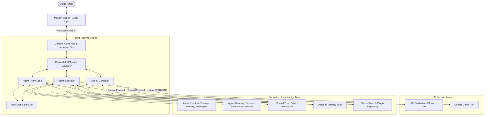
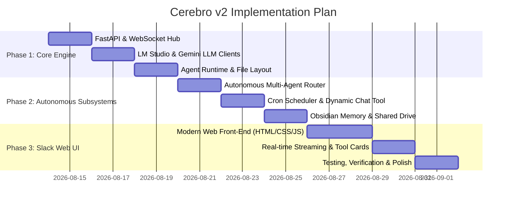

# Cerebro v2: Autonomous Agentic Team Headquarters
## Architecture & Upgrade Specification

> **Superseded for implementation purposes.** This document remains the *vision* statement and is
> still the best short description of what Cerebro v2 is for. The authoritative build spec — data
> model, protocols, safety mechanisms, and slice-by-slice plan — is
> [CEREBRO_V2_ARCHITECTURE.md](CEREBRO_V2_ARCHITECTURE.md). Where the two disagree, the
> architecture document wins; §17 there lists every deliberate divergence and why.

**Document Version**: 2.0.0  
**Target Execution Agents**: Claude (Architecture Review) & Gemini / Antigravity (Implementation)  
**Author**: Waylon Smithers (for Mr. Dante)  
**Date**: August 2026

---

## 1. Executive Summary & Vision

**Cerebro v2** transforms the legacy PyQt5 single-turn desktop prototype into an **autonomous, Slack-inspired local agentic headquarters**. It acts as a private company workspace where Dante collaborates with autonomous project teams comprised of local and cloud-powered AI agents.

Agents operate with independent personas, persistent Obsidian-backed memory, dedicated scratchpads, and the ability to autonomously create group chats, recruit peer agents, schedule cron jobs, execute and create shared tools, and collaborate on project artifacts in a shared team drive.

---

## 2. Core Architectural Pillars



---

## 3. Detailed Component Specifications

### 3.1. LLM Engine & Dual Provider Layer
Each agent independently configures its LLM backend provider:

1. **LM Studio (Local)**:
   - **Protocol**: OpenAI-compatible REST API (`http://localhost:1234/v1/chat/completions`).
   - **Tool Calling**: OpenAI Function Calling schema (`tools` array with JSON Schema parameters).
   - **Streaming**: Server-Sent Events (SSE) for token-by-token rendering.
2. **Google Gemini API (Cloud)**:
   - **Protocol**: Google Gemini REST / Python SDK with API Key per agent or inherited from environment (`GEMINI_API_KEY`).
   - **Capabilities**: Large context windows, multimodal support, and structured function calling.

---

### 3.2. Slack-Style Web Front-End UI/UX
The front-end is modernized from PyQt5 into a responsive, real-time web application (FastAPI backend + asynchronous WebSockets + sleek dark/light theme web interface):

* **Left Navigation Sidebar**:
  - **Project Teams**: Folders/categories grouping channels and agents (e.g. *Career-Ops*, *Cerebro Core*, *Research & Development*).
  - **Channels (#)**: Shared multi-agent topic streams.
  - **Direct Messages (@)**: 1-on-1 private threads with specific agents.
  - **Active Agent Roster**: Live status indicators (🟢 *Idle*, 🟡 *Thinking / Tool Running*, 🔵 *Scheduled*).
* **Central Chat Stream**:
  - **Omnipresent Access**: Dante has master access to view and participate in every channel, agent DM, or autonomous war room.
  - **Rich Message Cards**: Render markdown, syntax-highlighted code blocks, tool invocation accordions (inputs & outputs), and visual diffs.
  - **Block Quote Integration**: Flat message stream with `> quote` references (no nested thread silos).
  - **Input Box**: Rich autocomplete for `@agent_name`, `/slash_commands`, and file attachments from the shared drive.
* **Right Context Panel (Collapsible)**:
  - Agent Profile & Scratchpad viewer.
  - Channel participant list & channel-specific shared files.
  - Task scheduler / cron trigger monitor.

---

### 3.3. Multi-Agent Conversation & Speaking Protocol
In multi-agent channels:
1. **Explicit `@mention`**: The targeted agent is guaranteed to respond.
2. **Autonomous Evaluation**: When a message is posted without explicit tags, all listening agents in the channel run a lightweight prompt evaluation:
   > *"Given your persona [X] and current channel context, should you speak now? Return JSON `{speak: boolean, rationale: string}`."*
   If an agent determines it has meaningful insight or is asked implicitly, it enters the queue.
3. **Turn Arbitration**: A central queue prevents race conditions and token collisions, streaming agent replies sequentially with clear avatar badges.

---

### 3.4. Agent Autonomy & Execution Triggers
Agents are active workers, not passive chatbots:
1. **Cron & Scheduled Wakes**:
   - Each agent can define multiple recurring cron triggers (e.g., morning summary, code review passes, periodic data scraping).
   - Cron events post an automated prompt into the agent's DM or a designated channel.
2. **Dynamic Chat Creation**:
   - Agents possess the `create_chat(participants, topic, initial_message)` tool.
   - When an agent encounters a problem requiring peer expertise, it spawns a new group channel, recruits the necessary agents, includes Dante, and opens the discussion.

---

### 3.5. Agent Storage, Sandboxing & Shared Drive Architecture
All agent data is organized cleanly on disk:

```
cerebro/
├── agents/
│   ├── {agent_id}/
│   │   ├── profile.json       # Name, role, avatar, LLM provider config, cron jobs
│   │   ├── system_prompt.md   # Core system instructions and persona
│   │   ├── scratchpad.md      # Working memory, ongoing notes, task tracking
│   │   ├── memory/            # Obsidian-compatible markdown notes & facts
│   │   ├── logs/              # Conversation and tool execution logs
│   │   └── tools/             # Agent-specific custom Python tools
├── workspace/
│   ├── shared/                # Global shared drive accessible to all agents
│   └── projects/              # Project-specific shared directories
│       ├── {project_name}/
└── tools/
    ├── system/                # Core system tools (create_chat, file_ops, web_search)
    └── community/             # Shared agent-created tools
```

* **Shared Drive Integration**: Every agent is injected with prompt awareness and filesystem tools pointing to `workspace/shared/` and `workspace/projects/{project_name}/`.
* **Dynamic Tool Authoring**: Agents can write new Python tool scripts into `tools/community/` and register them dynamically for peer agents.
* **Obsidian Memory System**: Memory files follow Obsidian markdown standard (`frontmatter`, tags, and wikilinks) compatible with Dante's shared Obsidian vault (`D:\Obsidian\MyVault\Claude Memory`).

---

### 3.6. Subsystem Consolidation & Legacy Migration

| Legacy PyQt5 Feature | Cerebro v2 Strategy |
| :--- | :--- |
| **PyQt5 GUI (`app.py`, `tab_*.py`)** | **Replaced**: FastAPI async web server + WebSocket real-time frontend (accessible via local browser or PyWebView desktop shell). |
| **Ollama Backend (`local_llm_helper.py`)** | **Replaced**: Unified LLM client supporting LM Studio (`localhost:1234`) and Gemini API (`gemini-2.5-*` / `gemini-1.5-*`). |
| **Automations Tab (`pyautogui`, `pynput`)** | **Refactored**: Converted into an optional specialized tool module (`desktop_automation_tool.py`) available to authorized agents. |
| **Fine-Tuning Tab (`fine_tuning.py`)** | **Retired**: Moved to external offline utility script; removed from primary conversational UI. |
| **Tasks Tab (`tab_tasks.py`, `tasks.py`)** | **Integrated**: Upgraded into agent-native multi-cron scheduling engine with UI overview tab. |
| **Workflows Tab (`workflows.py`)** | **Integrated**: Dynamic multi-agent group chats and `@mentions` replace rigid hardcoded pipelines. |

---

## 4. Phased Implementation Roadmap



### Phase 1: Core Backend & Multi-Provider Engine
1. Set up modern async backend with FastAPI and WebSockets for real-time bi-directional streaming.
2. Implement `LMStudioClient` (OpenAI format + function calling) and `GeminiClient` with unified streaming interfaces.
3. Establish agent directory structure (`cerebro/agents/{agent_id}/`) and migration of existing agents.

### Phase 2: Agent Autonomy, Memory & Shared Drive
1. Build central message broker with `@mention` parser, autonomous turn evaluator, and queue arbitration.
2. Implement built-in agent tools: `create_chat`, `invite_agent`, `read_file`, `write_file`, `execute_tool`, `publish_tool`.
3. Integrate Obsidian-compatible markdown memory reader/writer and mount the shared project drive.
4. Build multi-cron background scheduler for proactive agent tasks.

### Phase 3: Modern Slack-Like Web Interface
1. Develop clean, responsive Slack-style web frontend (sidebar channels/DMs, central streaming feed, quote rendering, collapsible agent info).
2. Render live tool execution accordions, token metrics, and thinking blocks.
3. Package with seamless local startup script (`run.py` or lightweight PyWebView desktop runner).
4. Run full unit and integration test suite.

---

## 5. Summary for Claude Review

This specification provides the blueprint for transforming Cerebro into Dante's unified autonomous agentic headquarters. When reviewing with Claude, the key focus points are:
1. Concurrency and turn-arbitration logic in multi-agent group channels.
2. Structure and schema of the dynamic `create_chat` and `publish_tool` agent capabilities.
3. Alignment of agent memory formatting with the shared Obsidian vault.
